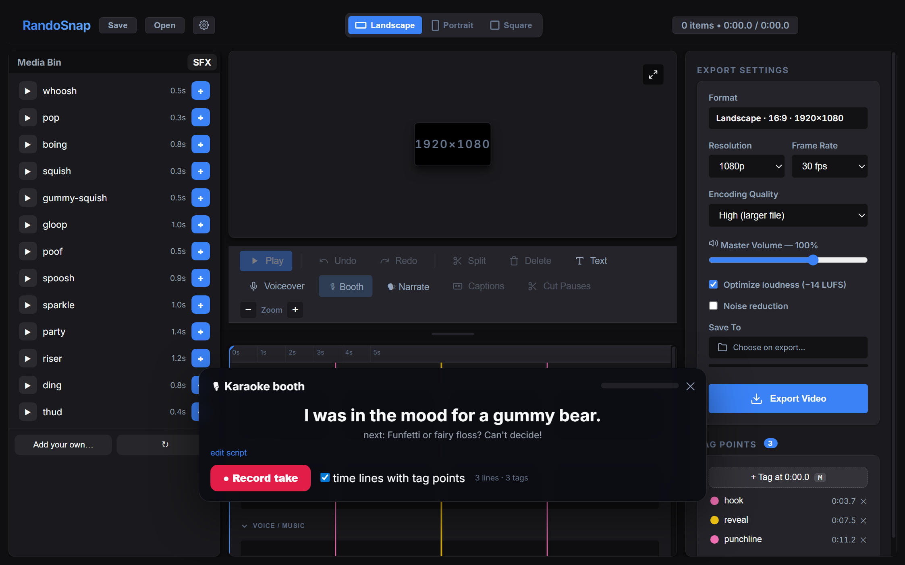

# RandoSnap 🎬

**A lean desktop video editor for makers who narrate their own videos.**

RandoSnap is an Electron + React editor built around one workflow: drop in footage, **tag the beats**, add **sound effects** and **narration** (your mic, a karaoke-style read-along, or a cloned voice), and export a **YouTube-ready** MP4 — correct resolution, loudness and encoding, every time.

Everything runs locally. FFmpeg does the rendering, Whisper runs on-device for captions, and the SFX library is synthesized on your machine — no accounts, no uploads, no license worries.



## Features

**Your workflow, automated**
- **Start Recipe** — standing instructions like start G-code: a plain-text block with toggle chips (off = `#`-commented), free-type welcome. Default pipeline: cut dead air → thumbnail picker (frame + catchy subtitle + your logo) → 5 AI-pitched titles → brand watermark → intro sting at 0:00. One click (🚀 Recipe) or one sentence to your AI runs it
- **Robust pause removal** — trim-aware audio analysis, tail-silence detection, overlap-safe splicing with crossfades

**Editing**
- Timeline with filmstrip thumbnails, trim/split/ripple, snapping, undo/redo
- **Tag points** — press `M` to mark beats (a joke, a reveal, a cut). Tags are visible flags on the ruler; clips snap to them, SFX drop on them, narration lines align to them
- Text overlays with fades, draggable on the preview
- Volume automation (draw a gain curve on any clip), per-clip fades, crossfades
- **Cut Pauses** — detects silent gaps *or* motionless stretches and ripples them out

**Audio** (three labeled lanes: `VOICE / MUSIC`, `SFX`, plus each video's own sound)
- **SFX library** — 13 built-in synthesized effects (whoosh, pop, boing, squish, gloop, poof, sparkle, party horn…). Audition with one click, place at the playhead. Drop your own WAV/MP3s into the custom folder and they appear alongside
- **Karaoke booth** — paste your script, hit record: the video plays, lines light up in time (evenly, or pinned to your tag points), you read along in **one take**, and the take lands on the voice track
- **Cloned-voice narration** — plug in any TTS/voice-clone CLI (XTTS recipe included, see [docs/VOICE_CLONE.md](docs/VOICE_CLONE.md)); generated lines are placed at your tag points automatically
- Loudness done right: one checkbox masters the mix to YouTube's target with a compressor + `loudnorm`; optional noise reduction

**🤖 AI copilot built in**
- RandoSnap ships an **MCP server** — open the repo in Claude Code (or wire it to Claude Desktop) and your AI assistant can drive the running app **while you watch**: read the timeline, drop SFX on your tag points, write titles, seek your window, take screenshots of what you see, and export with a quality report
- You edit in the GUI, the agent edits through the bridge — same timeline, live, with shared undo. Tag points become the language between you: you mark the beats, it does the busywork
- Zero config in Claude Code (`.mcp.json` is auto-discovered) · works with any framework via plain HTTP — see [docs/AGENT.md](docs/AGENT.md)

**Finishing**
- On-device **Whisper captions** (phrase or word-by-word karaoke style, 10+ languages)
- Brand kit: your logo as intro bug / outro watermark on every export
- Landscape · Portrait · Square presets up to 4K, 24/30/60 fps
- **Watch & Verify** — every export is auto-checked (loudness, true peak, black frames, sampled stills) before you upload

## Quickstart

```bash
git clone https://github.com/RandoTechNerd/RandoSnap
cd RandoSnap
npm install
npm run dev        # full desktop app (Electron)
```

> **Windows-first.** FFmpeg/FFprobe binaries ship via npm (`ffmpeg-static`) — no manual install. macOS/Linux need two small path tweaks; see [docs/ARCHITECTURE.md](docs/ARCHITECTURE.md#platform-notes).

Other commands:

```bash
npm run dev:web    # UI only, in a plain browser (mock backend — great for UI work)
npm run typecheck  # strict TS across renderer + main process
npm run build      # production build + installer (electron-builder)
```

## The 5-minute workflow

1. **Import** — drag videos/images/audio into the Media Bin (or straight onto the timeline).
2. **Tag the beats** — play through once, tap `M` at every moment that matters. Name the tags in the right panel.
3. **Tighten** — `Cut Pauses` removes dead air; split/trim around your tags (clips snap to them).
4. **Narrate** — pick one:
   - 🎙 **Booth**: paste your script, one line per tag, record a single read-along take;
   - 🗣 **Narrate**: generate the lines with your cloned voice;
   - or plain **Voiceover** punch-in at the playhead.
5. **Sound** — open the **SFX** tab, audition, `+` to drop effects at the playhead/tags.
6. **Export** — pick orientation/resolution, leave *Optimize loudness* on, hit Export, and let **Watch & Verify** confirm it's upload-ready.

Full walkthrough with details: [docs/WORKFLOW.md](docs/WORKFLOW.md)

## Docs

| Doc | What's inside |
|---|---|
| [docs/WORKFLOW.md](docs/WORKFLOW.md) | The full editing pipeline, keyboard shortcuts, audio lanes explained |
| [docs/AGENT.md](docs/AGENT.md) | Let Claude (or any agent) drive the app live — setup + tool list |
| [docs/PROJECT_FORMAT.md](docs/PROJECT_FORMAT.md) | The JSON project/state format for scripts and tooling |
| [docs/ARCHITECTURE.md](docs/ARCHITECTURE.md) | How the app is built — for contributors |
| [docs/VOICE_CLONE.md](docs/VOICE_CLONE.md) | Set up free local voice cloning (XTTS-v2) and wire it to the Narrate button |

## License

MIT — see [LICENSE](LICENSE).
